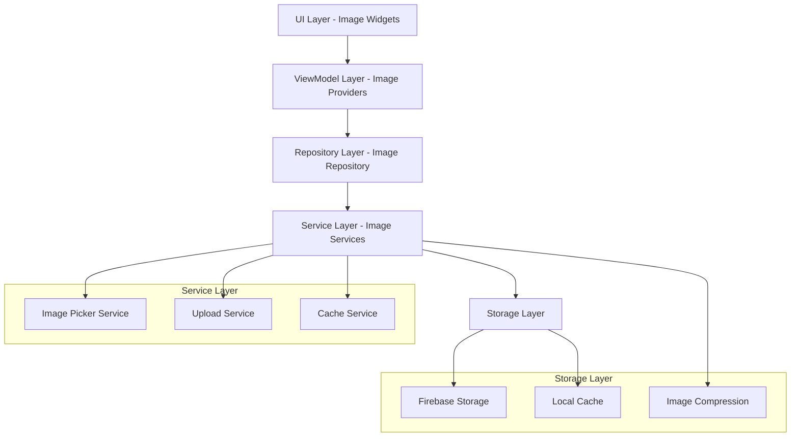
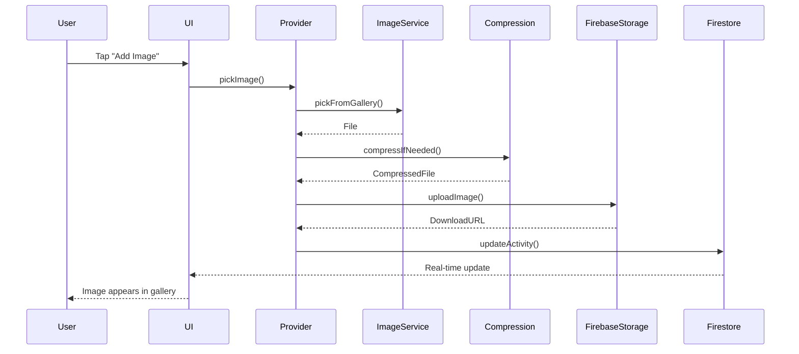

# Design Document

## Overview

The Activity Image Management feature extends the existing Trip Planner application by adding comprehensive image support to activities. This feature integrates with Firebase Storage for cloud storage, implements automatic image compression, and provides an intuitive gallery interface. The design follows the existing MVVM architecture with Riverpod state management and maintains real-time collaboration capabilities.

## Architecture

### High-Level Architecture



### Image Data Flow



## Components and Interfaces

### Enhanced Activity Model

```dart
@freezed
abstract class Activity with _$Activity {
  const factory Activity({
    required String id,
    required String tripId,
    required String place,
    required String activityType,
    String? price,
    String? notes,
    String? assignedDay,
    int? dayOrder,
    String? timeSlot,
    required String createdBy,
    @TimestampConverter() required DateTime createdAt,
    @Default([]) List<BrainstormIdea> brainstormIdeas,
    @Default([]) List<ActivityImage> images, // New field for images
  }) = _Activity;
  
  const Activity._();
  
  factory Activity.fromJson(Map<String, dynamic> json) => _$ActivityFromJson(json);
  
  /// Check if activity can accept more images (max 5)
  bool get canAddMoreImages => images.length < 5;
  
  /// Get images count display text
  String get imagesCountText => '${images.length} of 5 images';
  
  /// Convert to JSON with proper serialization for Firestore
  Map<String, dynamic> toFirestoreJson() {
    final json = _$ActivityToJson(this as _Activity);
    json['createdAt'] = Timestamp.fromDate(createdAt);
    json['brainstormIdeas'] = brainstormIdeas.map((idea) => idea.toJson()).toList();
    json['images'] = images.map((image) => image.toJson()).toList();
    return json;
  }
}
```

### Activity Image Model

```dart
@freezed
abstract class ActivityImage with _$ActivityImage {
  const factory ActivityImage({
    required String id,
    required String url, // Firebase Storage download URL
    required String storagePath, // Firebase Storage path for deletion
    required String uploadedBy,
    @TimestampConverter() required DateTime uploadedAt,
    required String originalFileName,
    required int fileSizeBytes,
    int? order, // For custom ordering
    String? caption, // Optional user caption
  }) = _ActivityImage;
  
  const ActivityImage._();
  
  factory ActivityImage.fromJson(Map<String, dynamic> json) => _$ActivityImageFromJson(json);
  
  /// Get file size in human readable format
  String get fileSizeFormatted {
    if (fileSizeBytes < 1024) return '${fileSizeBytes}B';
    if (fileSizeBytes < 1024 * 1024) return '${(fileSizeBytes / 1024).toStringAsFixed(1)}KB';
    return '${(fileSizeBytes / (1024 * 1024)).toStringAsFixed(1)}MB';
  }
  
  /// Get relative time since upload
  String get uploadedTimeAgo {
    final now = DateTime.now();
    final difference = now.difference(uploadedAt);
    
    if (difference.inMinutes < 1) return 'Just now';
    if (difference.inMinutes < 60) return '${difference.inMinutes}m ago';
    if (difference.inHours < 24) return '${difference.inHours}h ago';
    if (difference.inDays < 7) return '${difference.inDays}d ago';
    return '${(difference.inDays / 7).floor()}w ago';
  }
}
```

### Image Service Interface

```dart
abstract class ImageService {
  /// Pick image from gallery
  Future<File?> pickFromGallery();
  
  /// Pick image from camera
  Future<File?> pickFromCamera();
  
  /// Compress image if it exceeds size limit
  Future<File> compressImage(File imageFile, {int maxSizeBytes = 3 * 1024 * 1024});
  
  /// Get image file size
  Future<int> getFileSize(File file);
  
  /// Generate thumbnail for image
  Future<File> generateThumbnail(File imageFile, {int maxWidth = 300});
}

abstract class ImageStorageService {
  /// Upload image to Firebase Storage
  Future<String> uploadImage(File imageFile, String storagePath, {
    Function(double)? onProgress,
  });
  
  /// Delete image from Firebase Storage
  Future<void> deleteImage(String storagePath);
  
  /// Get download URL for image
  Future<String> getDownloadUrl(String storagePath);
}
```

### Image Service Implementation

```dart
class ImageServiceImpl implements ImageService {
  final ImagePicker _picker = ImagePicker();
  final Logger _logger = Logger();
  
  @override
  Future<File?> pickFromGallery() async {
    try {
      final XFile? image = await _picker.pickImage(
        source: ImageSource.gallery,
        maxWidth: 2048,
        maxHeight: 2048,
        imageQuality: 85,
      );
      
      if (image != null) {
        return File(image.path);
      }
      return null;
    } catch (e) {
      _logger.e('Error picking image from gallery: $e');
      rethrow;
    }
  }
  
  @override
  Future<File?> pickFromCamera() async {
    try {
      final XFile? image = await _picker.pickImage(
        source: ImageSource.camera,
        maxWidth: 2048,
        maxHeight: 2048,
        imageQuality: 85,
      );
      
      if (image != null) {
        return File(image.path);
      }
      return null;
    } catch (e) {
      _logger.e('Error picking image from camera: $e');
      rethrow;
    }
  }
  
  @override
  Future<File> compressImage(File imageFile, {int maxSizeBytes = 3 * 1024 * 1024}) async {
    try {
      final fileSize = await getFileSize(imageFile);
      
      if (fileSize <= maxSizeBytes) {
        return imageFile; // No compression needed
      }
      
      _logger.d('Compressing image from ${fileSize}B to max ${maxSizeBytes}B');
      
      // Calculate compression quality based on file size
      int quality = 85;
      if (fileSize > maxSizeBytes * 2) {
        quality = 60;
      } else if (fileSize > maxSizeBytes * 1.5) {
        quality = 70;
      }
      
      final compressedFile = await FlutterImageCompress.compressAndGetFile(
        imageFile.absolute.path,
        '${imageFile.parent.path}/compressed_${DateTime.now().millisecondsSinceEpoch}.jpg',
        quality: quality,
        minWidth: 800,
        minHeight: 600,
      );
      
      if (compressedFile != null) {
        final compressedSize = await getFileSize(File(compressedFile.path));
        _logger.i('Image compressed from ${fileSize}B to ${compressedSize}B');
        return File(compressedFile.path);
      } else {
        throw Exception('Image compression failed');
      }
    } catch (e) {
      _logger.e('Error compressing image: $e');
      rethrow;
    }
  }
  
  @override
  Future<int> getFileSize(File file) async {
    try {
      return await file.length();
    } catch (e) {
      _logger.e('Error getting file size: $e');
      rethrow;
    }
  }
  
  @override
  Future<File> generateThumbnail(File imageFile, {int maxWidth = 300}) async {
    try {
      final thumbnailFile = await FlutterImageCompress.compressAndGetFile(
        imageFile.absolute.path,
        '${imageFile.parent.path}/thumb_${DateTime.now().millisecondsSinceEpoch}.jpg',
        quality: 70,
        minWidth: maxWidth,
        minHeight: (maxWidth * 0.75).round(),
      );
      
      if (thumbnailFile != null) {
        return File(thumbnailFile.path);
      } else {
        throw Exception('Thumbnail generation failed');
      }
    } catch (e) {
      _logger.e('Error generating thumbnail: $e');
      rethrow;
    }
  }
}

class FirebaseImageStorageService implements ImageStorageService {
  final FirebaseStorage _storage = FirebaseStorage.instance;
  final Logger _logger = Logger();
  
  @override
  Future<String> uploadImage(File imageFile, String storagePath, {
    Function(double)? onProgress,
  }) async {
    try {
      _logger.d('Uploading image to: $storagePath');
      
      final ref = _storage.ref().child(storagePath);
      final uploadTask = ref.putFile(imageFile);
      
      // Listen to upload progress
      if (onProgress != null) {
        uploadTask.snapshotEvents.listen((TaskSnapshot snapshot) {
          final progress = snapshot.bytesTransferred / snapshot.totalBytes;
          onProgress(progress);
        });
      }
      
      final snapshot = await uploadTask;
      final downloadUrl = await snapshot.ref.getDownloadURL();
      
      _logger.i('Image uploaded successfully: $downloadUrl');
      return downloadUrl;
    } catch (e) {
      _logger.e('Error uploading image: $e');
      rethrow;
    }
  }
  
  @override
  Future<void> deleteImage(String storagePath) async {
    try {
      _logger.d('Deleting image from: $storagePath');
      
      final ref = _storage.ref().child(storagePath);
      await ref.delete();
      
      _logger.i('Image deleted successfully: $storagePath');
    } catch (e) {
      _logger.e('Error deleting image: $e');
      rethrow;
    }
  }
  
  @override
  Future<String> getDownloadUrl(String storagePath) async {
    try {
      final ref = _storage.ref().child(storagePath);
      return await ref.getDownloadURL();
    } catch (e) {
      _logger.e('Error getting download URL: $e');
      rethrow;
    }
  }
}
```

### Enhanced Activity Repository

```dart
abstract class ActivityRepository {
  // ... existing methods ...
  
  /// Add image to activity
  Future<Activity> addImageToActivity(String activityId, ActivityImage image);
  
  /// Remove image from activity
  Future<Activity> removeImageFromActivity(String activityId, String imageId);
  
  /// Update image order in activity
  Future<Activity> reorderActivityImages(String activityId, List<String> imageIds);
  
  /// Update image caption
  Future<Activity> updateImageCaption(String activityId, String imageId, String caption);
}

// Firebase implementation extension
class FirebaseActivityRepository implements ActivityRepository {
  // ... existing implementation ...
  
  @override
  Future<Activity> addImageToActivity(String activityId, ActivityImage image) async {
    try {
      _logger.d('Adding image to activity: $activityId');
      
      if (activityId.isEmpty) {
        throw Exception('Activity ID cannot be empty');
      }
      
      // Get the current activity
      final activityDoc = await _firestore
          .collection(_activitiesCollection)
          .doc(activityId)
          .get();
      
      if (!activityDoc.exists) {
        throw Exception('Activity not found');
      }
      
      final activityData = activityDoc.data()!;
      activityData['id'] = activityDoc.id;
      final activity = Activity.fromJson(activityData);
      
      // Check image limit
      if (activity.images.length >= 5) {
        throw Exception('Maximum of 5 images allowed per activity');
      }
      
      // Create new image with generated ID and order
      final newImage = image.copyWith(
        id: _firestore.collection('temp').doc().id,
        uploadedAt: DateTime.now(),
        order: activity.images.length,
      );
      
      // Add the new image to the existing list
      final updatedImages = [...activity.images, newImage];
      
      // Update the activity with the new images
      await _firestore
          .collection(_activitiesCollection)
          .doc(activityId)
          .update({
        'images': updatedImages.map((img) => img.toJson()).toList(),
      });
      
      _logger.i('Image added to activity: $activityId');
      
      return activity.copyWith(images: updatedImages);
    } catch (e) {
      _logger.e('Error adding image to activity: $e');
      rethrow;
    }
  }
  
  @override
  Future<Activity> removeImageFromActivity(String activityId, String imageId) async {
    try {
      _logger.d('Removing image $imageId from activity: $activityId');
      
      if (activityId.isEmpty || imageId.isEmpty) {
        throw Exception('Activity ID and Image ID cannot be empty');
      }
      
      // Get the current activity
      final activityDoc = await _firestore
          .collection(_activitiesCollection)
          .doc(activityId)
          .get();
      
      if (!activityDoc.exists) {
        throw Exception('Activity not found');
      }
      
      final activityData = activityDoc.data()!;
      activityData['id'] = activityDoc.id;
      final activity = Activity.fromJson(activityData);
      
      // Find and remove the image
      final imageToRemove = activity.images.firstWhere(
        (img) => img.id == imageId,
        orElse: () => throw Exception('Image not found'),
      );
      
      final updatedImages = activity.images.where((img) => img.id != imageId).toList();
      
      // Reorder remaining images
      for (int i = 0; i < updatedImages.length; i++) {
        updatedImages[i] = updatedImages[i].copyWith(order: i);
      }
      
      // Update the activity with the filtered images
      await _firestore
          .collection(_activitiesCollection)
          .doc(activityId)
          .update({
        'images': updatedImages.map((img) => img.toJson()).toList(),
      });
      
      _logger.i('Image removed from activity: $activityId');
      
      return activity.copyWith(images: updatedImages);
    } catch (e) {
      _logger.e('Error removing image from activity: $e');
      rethrow;
    }
  }
  
  @override
  Future<Activity> reorderActivityImages(String activityId, List<String> imageIds) async {
    try {
      _logger.d('Reordering images for activity: $activityId');
      
      if (activityId.isEmpty) {
        throw Exception('Activity ID cannot be empty');
      }
      
      // Get the current activity
      final activityDoc = await _firestore
          .collection(_activitiesCollection)
          .doc(activityId)
          .get();
      
      if (!activityDoc.exists) {
        throw Exception('Activity not found');
      }
      
      final activityData = activityDoc.data()!;
      activityData['id'] = activityDoc.id;
      final activity = Activity.fromJson(activityData);
      
      // Create a map of existing images for quick lookup
      final imageMap = {
        for (var image in activity.images) image.id: image
      };
      
      // Reorder images based on the provided order
      final reorderedImages = <ActivityImage>[];
      for (int i = 0; i < imageIds.length; i++) {
        final imageId = imageIds[i];
        final image = imageMap[imageId];
        if (image != null) {
          reorderedImages.add(image.copyWith(order: i));
        }
      }
      
      // Update the activity with reordered images
      await _firestore
          .collection(_activitiesCollection)
          .doc(activityId)
          .update({
        'images': reorderedImages.map((img) => img.toJson()).toList(),
      });
      
      _logger.i('Images reordered for activity: $activityId');
      
      return activity.copyWith(images: reorderedImages);
    } catch (e) {
      _logger.e('Error reordering images: $e');
      rethrow;
    }
  }
  
  @override
  Future<Activity> updateImageCaption(String activityId, String imageId, String caption) async {
    try {
      _logger.d('Updating image caption for activity: $activityId');
      
      // Get the current activity
      final activityDoc = await _firestore
          .collection(_activitiesCollection)
          .doc(activityId)
          .get();
      
      if (!activityDoc.exists) {
        throw Exception('Activity not found');
      }
      
      final activityData = activityDoc.data()!;
      activityData['id'] = activityDoc.id;
      final activity = Activity.fromJson(activityData);
      
      // Update the specific image's caption
      final updatedImages = activity.images.map((img) {
        if (img.id == imageId) {
          return img.copyWith(caption: caption.trim().isEmpty ? null : caption.trim());
        }
        return img;
      }).toList();
      
      // Update the activity with the updated images
      await _firestore
          .collection(_activitiesCollection)
          .doc(activityId)
          .update({
        'images': updatedImages.map((img) => img.toJson()).toList(),
      });
      
      _logger.i('Image caption updated for activity: $activityId');
      
      return activity.copyWith(images: updatedImages);
    } catch (e) {
      _logger.e('Error updating image caption: $e');
      rethrow;
    }
  }
}
```

### Image Management Provider

```dart
@riverpod
class ActivityImageNotifier extends _$ActivityImageNotifier {
  @override
  AsyncValue<List<ActivityImage>> build(String activityId) {
    final activityDetail = ref.watch(activityDetailNotifierProvider(activityId));
    return activityDetail.when(
      data: (activity) => AsyncValue.data(activity?.images ?? []),
      loading: () => const AsyncValue.loading(),
      error: (error, stack) => AsyncValue.error(error, stack),
    );
  }
  
  /// Add image to activity with compression and upload
  Future<void> addImage(ImageSource source) async {
    try {
      state = const AsyncValue.loading();
      
      final user = ref.read(authNotifierProvider).value;
      if (user == null) {
        throw Exception('User must be authenticated to add images');
      }
      
      final imageService = ref.read(imageServiceProvider);
      final storageService = ref.read(imageStorageServiceProvider);
      final activityRepository = ref.read(activityRepositoryProvider);
      
      // Pick image
      File? imageFile;
      if (source == ImageSource.gallery) {
        imageFile = await imageService.pickFromGallery();
      } else {
        imageFile = await imageService.pickFromCamera();
      }
      
      if (imageFile == null) {
        state = AsyncValue.data(state.value ?? []);
        return;
      }
      
      // Show compression progress
      ref.read(loadingNotifierProvider.notifier).showLoading('Optimizing image...');
      
      // Compress image if needed
      final compressedFile = await imageService.compressImage(imageFile);
      final fileSize = await imageService.getFileSize(compressedFile);
      
      // Generate storage path
      final fileName = '${const Uuid().v4()}.jpg';
      final storagePath = 'activities/$activityId/images/$fileName';
      
      // Show upload progress
      ref.read(loadingNotifierProvider.notifier).showLoading('Uploading image...');
      
      // Upload to Firebase Storage
      final downloadUrl = await storageService.uploadImage(
        compressedFile,
        storagePath,
        onProgress: (progress) {
          ref.read(loadingNotifierProvider.notifier)
              .showLoading('Uploading image... ${(progress * 100).toInt()}%');
        },
      );
      
      // Create ActivityImage object
      final activityImage = ActivityImage(
        id: '', // Will be set by repository
        url: downloadUrl,
        storagePath: storagePath,
        uploadedBy: user.id,
        uploadedAt: DateTime.now(),
        originalFileName: path.basename(imageFile.path),
        fileSizeBytes: fileSize,
      );
      
      // Add to activity
      await activityRepository.addImageToActivity(activityId, activityImage);
      
      ref.read(loadingNotifierProvider.notifier).hideLoading();
      ref.read(successNotifierProvider.notifier)
          .showSuccessWithAutoClear('Image added successfully!');
      
      // Clean up temporary files
      try {
        if (compressedFile.path != imageFile.path) {
          await compressedFile.delete();
        }
      } catch (e) {
        // Ignore cleanup errors
      }
      
    } catch (error) {
      ref.read(loadingNotifierProvider.notifier).hideLoading();
      final appError = _handleImageError(error);
      ref.read(errorNotifierProvider.notifier).showError(appError);
      state = AsyncValue.error(error, StackTrace.current);
      rethrow;
    }
  }
  
  /// Remove image from activity and storage
  Future<void> removeImage(String imageId) async {
    try {
      final currentImages = state.value ?? [];
      final imageToRemove = currentImages.firstWhere(
        (img) => img.id == imageId,
        orElse: () => throw Exception('Image not found'),
      );
      
      final storageService = ref.read(imageStorageServiceProvider);
      final activityRepository = ref.read(activityRepositoryProvider);
      
      // Remove from Firebase Storage
      await storageService.deleteImage(imageToRemove.storagePath);
      
      // Remove from activity
      await activityRepository.removeImageFromActivity(activityId, imageId);
      
      ref.read(successNotifierProvider.notifier)
          .showSuccessWithAutoClear('Image removed successfully!');
      
    } catch (error) {
      final appError = _handleImageError(error);
      ref.read(errorNotifierProvider.notifier).showError(appError);
      rethrow;
    }
  }
  
  /// Reorder images in activity
  Future<void> reorderImages(List<String> imageIds) async {
    try {
      final activityRepository = ref.read(activityRepositoryProvider);
      await activityRepository.reorderActivityImages(activityId, imageIds);
      
      ref.read(successNotifierProvider.notifier)
          .showSuccessWithAutoClear('Images reordered successfully!');
      
    } catch (error) {
      final appError = _handleImageError(error);
      ref.read(errorNotifierProvider.notifier).showError(appError);
      rethrow;
    }
  }
  
  /// Update image caption
  Future<void> updateCaption(String imageId, String caption) async {
    try {
      final activityRepository = ref.read(activityRepositoryProvider);
      await activityRepository.updateImageCaption(activityId, imageId, caption);
      
      ref.read(successNotifierProvider.notifier)
          .showSuccessWithAutoClear('Caption updated successfully!');
      
    } catch (error) {
      final appError = _handleImageError(error);
      ref.read(errorNotifierProvider.notifier).showError(appError);
      rethrow;
    }
  }
  
  AppError _handleImageError(Object error) {
    if (error.toString().contains('Maximum of 5 images')) {
      return const AppError.validation('Maximum of 5 images allowed per activity.');
    } else if (error.toString().contains('network')) {
      return const AppError.network('Network error while managing images. Please check your connection.');
    } else if (error.toString().contains('storage')) {
      return const AppError.unknown('Storage error. Please try again.');
    } else {
      return const AppError.unknown('An error occurred while managing images. Please try again.');
    }
  }
}

// Service providers
@riverpod
ImageService imageService(Ref ref) => ImageServiceImpl();

@riverpod
ImageStorageService imageStorageService(Ref ref) => FirebaseImageStorageService();
```

## Data Models

### Image Upload State

```dart
@freezed
class ImageUploadState with _$ImageUploadState {
  const factory ImageUploadState({
    @Default(false) bool isUploading,
    @Default(0.0) double progress,
    String? fileName,
    String? error,
  }) = _ImageUploadState;
}
```

## Error Handling

### Image-Specific Error Types

```dart
enum ImageErrorType {
  fileTooLarge,
  unsupportedFormat,
  uploadFailed,
  compressionFailed,
  storageError,
  networkError,
  permissionDenied,
  imageLimitExceeded,
}

@freezed
class ImageError with _$ImageError {
  const factory ImageError({
    required ImageErrorType type,
    required String message,
    String? details,
  }) = _ImageError;
  
  String get userFriendlyMessage {
    switch (type) {
      case ImageErrorType.fileTooLarge:
        return 'Image file is too large. Please select a smaller image.';
      case ImageErrorType.unsupportedFormat:
        return 'Unsupported image format. Please select a JPEG or PNG image.';
      case ImageErrorType.uploadFailed:
        return 'Failed to upload image. Please check your connection and try again.';
      case ImageErrorType.compressionFailed:
        return 'Failed to optimize image. Please try a different image.';
      case ImageErrorType.storageError:
        return 'Storage error occurred. Please try again later.';
      case ImageErrorType.networkError:
        return 'Network error. Please check your connection.';
      case ImageErrorType.permissionDenied:
        return 'Permission denied. Please allow access to photos.';
      case ImageErrorType.imageLimitExceeded:
        return 'Maximum of 5 images allowed per activity.';
    }
  }
}
```

## Testing Strategy

### Unit Tests

```dart
// Test image compression
void main() {
  group('ImageService', () {
    late ImageService imageService;
    
    setUp(() {
      imageService = ImageServiceImpl();
    });
    
    test('should compress large images', () async {
      // Create mock large image file
      final largeImageFile = await createMockImageFile(size: 5 * 1024 * 1024);
      
      final compressedFile = await imageService.compressImage(largeImageFile);
      final compressedSize = await imageService.getFileSize(compressedFile);
      
      expect(compressedSize, lessThan(3 * 1024 * 1024));
    });
    
    test('should not compress small images', () async {
      final smallImageFile = await createMockImageFile(size: 1 * 1024 * 1024);
      
      final result = await imageService.compressImage(smallImageFile);
      
      expect(result.path, equals(smallImageFile.path));
    });
  });
}
```

### Integration Tests

```dart
void main() {
  group('Activity Image Integration', () {
    testWidgets('should add image to activity', (tester) async {
      // Setup mock providers
      final container = ProviderContainer(
        overrides: [
          imageServiceProvider.overrideWithValue(MockImageService()),
          imageStorageServiceProvider.overrideWithValue(MockImageStorageService()),
        ],
      );
      
      await tester.pumpWidget(
        UncontrolledProviderScope(
          container: container,
          child: MaterialApp(
            home: ActivityDetailScreen(activityId: 'test-activity'),
          ),
        ),
      );
      
      // Tap add image button
      await tester.tap(find.byIcon(Icons.add_photo_alternate));
      await tester.pumpAndSettle();
      
      // Select gallery option
      await tester.tap(find.text('Gallery'));
      await tester.pumpAndSettle();
      
      // Verify image was added
      expect(find.byType(ActivityImageCard), findsOneWidget);
    });
  });
}
```

## Performance Considerations

### Image Optimization

1. **Automatic Compression**: Images over 3MB are automatically compressed
2. **Progressive Loading**: High-resolution images load progressively
3. **Thumbnail Generation**: Generate thumbnails for gallery view
4. **Lazy Loading**: Load images only when visible
5. **Cache Management**: Implement intelligent caching strategy

### Memory Management

```dart
class ImageCacheManager {
  static const int maxCacheSize = 100 * 1024 * 1024; // 100MB
  static const int maxCacheAge = 7 * 24 * 60 * 60 * 1000; // 7 days
  
  static void configureCaching() {
    PaintingBinding.instance.imageCache.maximumSizeBytes = maxCacheSize;
    PaintingBinding.instance.imageCache.maximumSize = 100;
  }
  
  static void clearExpiredCache() {
    PaintingBinding.instance.imageCache.clear();
  }
}
```

## Security Considerations

### Firebase Storage Rules

```javascript
rules_version = '2';
service firebase.storage {
  match /b/{bucket}/o {
    // Activity images
    match /activities/{activityId}/images/{imageId} {
      allow read: if isAuthenticated() && hasAccessToTrip(activityId);
      allow write: if isAuthenticated() && hasAccessToTrip(activityId) 
                   && isValidImageFile() && isWithinSizeLimit();
      allow delete: if isAuthenticated() && (isOwner() || isUploader());
    }
  }
  
  function isAuthenticated() {
    return request.auth != null;
  }
  
  function hasAccessToTrip(activityId) {
    // Check if user has access to the trip containing this activity
    return true; // Implement based on your access control logic
  }
  
  function isValidImageFile() {
    return request.resource.contentType.matches('image/.*');
  }
  
  function isWithinSizeLimit() {
    return request.resource.size < 10 * 1024 * 1024; // 10MB limit
  }
  
  function isOwner() {
    // Check if user is the activity owner
    return true; // Implement based on your ownership logic
  }
  
  function isUploader() {
    // Check if user uploaded this specific image
    return true; // Implement based on your upload tracking
  }
}
```

### Input Validation

```dart
class ImageValidator {
  static const List<String> allowedExtensions = ['.jpg', '.jpeg', '.png', '.webp'];
  static const int maxFileSizeBytes = 10 * 1024 * 1024; // 10MB
  static const int minImageDimension = 100;
  static const int maxImageDimension = 4096;
  
  static Future<bool> validateImageFile(File imageFile) async {
    // Check file extension
    final extension = path.extension(imageFile.path).toLowerCase();
    if (!allowedExtensions.contains(extension)) {
      throw ImageError(
        type: ImageErrorType.unsupportedFormat,
        message: 'Unsupported file format: $extension',
      );
    }
    
    // Check file size
    final fileSize = await imageFile.length();
    if (fileSize > maxFileSizeBytes) {
      throw ImageError(
        type: ImageErrorType.fileTooLarge,
        message: 'File size exceeds ${maxFileSizeBytes}B limit',
      );
    }
    
    // Check image dimensions
    final image = await decodeImageFromList(await imageFile.readAsBytes());
    if (image.width < minImageDimension || image.height < minImageDimension) {
      throw ImageError(
        type: ImageErrorType.unsupportedFormat,
        message: 'Image dimensions too small',
      );
    }
    
    if (image.width > maxImageDimension || image.height > maxImageDimension) {
      throw ImageError(
        type: ImageErrorType.unsupportedFormat,
        message: 'Image dimensions too large',
      );
    }
    
    return true;
  }
}
```

This comprehensive design provides a robust foundation for implementing the Activity Image Management feature while maintaining consistency with the existing Trip Planner architecture and ensuring optimal performance, security, and user experience.