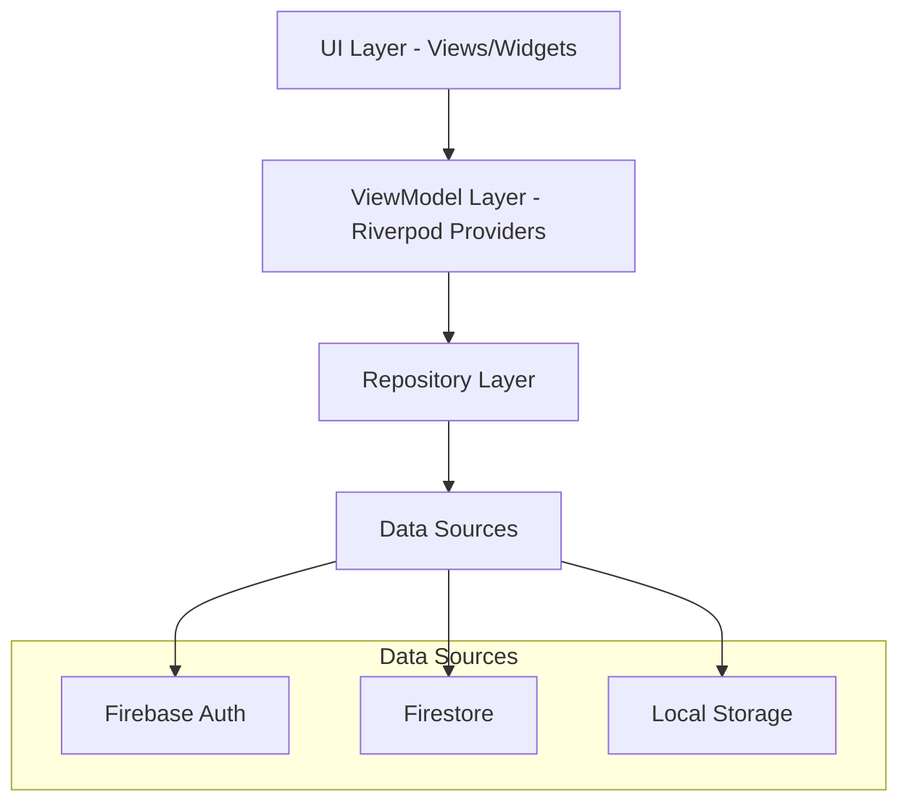

# Design Document

## Overview

The Trip Planner with Friends application is built using Flutter with Riverpod 3.0 for state management, following MVVM architecture with repository pattern. The app uses Firebase for authentication and data storage, with Go Router 16.0 for navigation. The design prioritizes simplicity, real-time collaboration, and cross-platform compatibility.

## Architecture

### High-Level Architecture



### MVVM with Riverpod 3 Pattern

- **View**: Flutter widgets that observe state changes
- **ViewModel**: Riverpod providers that manage business logic and state
- **Model**: Data models using Freezed for immutability
- **Repository**: Abstraction layer for data operations

### State Management Strategy

- **Riverpod 3** with code generation for type safety
- **AsyncValue** for handling loading, error, and data states
- **StateNotifier** for complex state management
- **Provider** for dependency injection

## Components and Interfaces

### Core Models

```dart
@freezed
abstract class Trip with _$Trip {
  const factory Trip({
    required String id,
    required String name,
    required int durationDays,
    required String ownerId,
    required List<String> collaboratorIds,
    required DateTime createdAt,
    required DateTime updatedAt,
    required List<TripDay> days, // Custom day titles and ordering
  }) = _Trip;
  
  factory Trip.fromJson(Map<String, dynamic> json) => _$TripFromJson(json);
}

@freezed
abstract class TripDay with _$TripDay {
  const factory TripDay({
    required String id,
    required int dayNumber,
    required String title, // Custom title like "Day 1: Go to XX"
    required int order, // For reordering days
    String? primaryLocation, // Main location for the day
  }) = _TripDay;
  
  factory TripDay.fromJson(Map<String, dynamic> json) => _$TripDayFromJson(json);
}

@freezed
abstract class Activity with _$Activity {
  const factory Activity({
    required String id,
    required String tripId,
    required String place,
    required String activityType,
    String? price,
    String? notes,
    String? assignedDay, // null if in activity pool
    int? dayOrder,
    String? timeSlot, // e.g., "09:00", "14:30" - time for the activity
    required String createdBy,
    required DateTime createdAt,
    required List<BrainstormIdea> brainstormIdeas,
  }) = _Activity;
  
  factory Activity.fromJson(Map<String, dynamic> json) => _$ActivityFromJson(json);
}

@freezed
abstract class BrainstormIdea with _$BrainstormIdea {
  const factory BrainstormIdea({
    required String id,
    required String description,
    required String createdBy,
    required DateTime createdAt,
    required int order, // for reordering brainstorm ideas
  }) = _BrainstormIdea;
  
  factory BrainstormIdea.fromJson(Map<String, dynamic> json) => _$BrainstormIdeaFromJson(json);
}

@freezed
abstract class User with _$User {
  const factory User({
    required String id,
    required String email,
    required String displayName,
    String? photoUrl,
  }) = _User;
  
  factory User.fromJson(Map<String, dynamic> json) => _$UserFromJson(json);
}
```

### Repository Interfaces

```dart
abstract class AuthRepository {
  Stream<User?> get authStateChanges;
  Future<User?> signInWithGoogle();
  Future<User?> signInWithApple();
  Future<void> signOut();
  User? get currentUser;
}

abstract class TripRepository {
  Stream<List<Trip>> getUserTrips(String userId);
  Future<Trip> createTrip(Trip trip);
  Future<Trip> updateTrip(Trip trip);
  Future<void> deleteTrip(String tripId);
  Future<void> addCollaborator(String tripId, String email);
  Future<Trip> updateDayTitle(String tripId, String dayId, String newTitle);
  Future<Trip> reorderDays(String tripId, List<String> dayIds);
}

abstract class ActivityRepository {
  Stream<List<Activity>> getTripActivities(String tripId);
  Future<Activity> createActivity(Activity activity);
  Future<Activity> updateActivity(Activity activity);
  Future<void> deleteActivity(String activityId);
  Future<Activity> addBrainstormIdea(String activityId, BrainstormIdea idea);
  Future<Activity> assignActivityToDay(String activityId, String day, String? timeSlot);
  Future<Activity> moveActivityToPool(String activityId);
  Future<void> reorderActivitiesInDay(String tripId, String day, List<String> activityIds);
  Future<void> reorderBrainstormIdeas(String activityId, List<String> ideaIds);
}
```

### Riverpod Providers

```dart
// Auth Providers
@riverpod
class AuthNotifier extends _$AuthNotifier {
  @override
  AsyncValue<User?> build() {
    return const AsyncValue.loading();
  }
  
  Future<void> signInWithGoogle() async {
    state = const AsyncValue.loading();
    try {
      final user = await ref.read(authRepositoryProvider).signInWithGoogle();
      state = AsyncValue.data(user);
    } catch (error, stackTrace) {
      state = AsyncValue.error(error, stackTrace);
    }
  }
}

// Trip Providers
@riverpod
class TripListNotifier extends _$TripListNotifier {
  @override
  Stream<List<Trip>> build() {
    final user = ref.watch(authNotifierProvider).value;
    if (user == null) return Stream.value([]);
    return ref.read(tripRepositoryProvider).getUserTrips(user.id);
  }
}

@riverpod
class TripDetailNotifier extends _$TripDetailNotifier {
  @override
  AsyncValue<Trip?> build(String tripId) {
    // Implementation for single trip management
  }
  
  Future<void> updateDayTitle(String dayId, String newTitle) async {
    final currentTrip = state.value;
    if (currentTrip == null) return;
    
    try {
      state = const AsyncValue.loading();
      final updatedTrip = await ref.read(tripRepositoryProvider)
          .updateDayTitle(currentTrip.id, dayId, newTitle);
      state = AsyncValue.data(updatedTrip);
    } catch (error, stackTrace) {
      state = AsyncValue.error(error, stackTrace);
    }
  }
  
  Future<void> reorderDays(List<String> dayIds) async {
    final currentTrip = state.value;
    if (currentTrip == null) return;
    
    try {
      state = const AsyncValue.loading();
      final updatedTrip = await ref.read(tripRepositoryProvider)
          .reorderDays(currentTrip.id, dayIds);
      state = AsyncValue.data(updatedTrip);
    } catch (error, stackTrace) {
      state = AsyncValue.error(error, stackTrace);
    }
  }
}

// Activity Providers
@riverpod
class ActivityListNotifier extends _$ActivityListNotifier {
  @override
  Stream<List<Activity>> build(String tripId) {
    return ref.read(activityRepositoryProvider).getTripActivities(tripId);
  }
  
  Future<void> assignActivityToDay(String activityId, String day, String? timeSlot) async {
    await ref.read(activityRepositoryProvider).assignActivityToDay(activityId, day, timeSlot);
  }
  
  Future<void> moveActivityToPool(String activityId) async {
    await ref.read(activityRepositoryProvider).moveActivityToPool(activityId);
  }
  
  Future<void> reorderActivitiesInDay(String day, List<String> activityIds) async {
    await ref.read(activityRepositoryProvider).reorderActivitiesInDay(tripId, day, activityIds);
  }
}

// Drag and Drop Provider
@riverpod
class DragDropNotifier extends _$DragDropNotifier {
  @override
  DragDropState build() {
    return const DragDropState();
  }
  
  void startDrag(Activity activity) {
    state = state.copyWith(draggedActivity: activity, isDragging: true);
  }
  
  void endDrag() {
    state = state.copyWith(draggedActivity: null, isDragging: false);
  }
  
  Future<void> dropOnDay(String day, String? timeSlot) async {
    if (state.draggedActivity != null) {
      await ref.read(activityListNotifierProvider(state.draggedActivity!.tripId).notifier)
          .assignActivityToDay(state.draggedActivity!.id, day, timeSlot);
      endDrag();
    }
  }
  
  Future<void> dropOnPool() async {
    if (state.draggedActivity != null) {
      await ref.read(activityListNotifierProvider(state.draggedActivity!.tripId).notifier)
          .moveActivityToPool(state.draggedActivity!.id);
      endDrag();
    }
  }
}

@freezed
class DragDropState with _$DragDropState {
  const factory DragDropState({
    Activity? draggedActivity,
    @Default(false) bool isDragging,
  }) = _DragDropState;
}
```

### Drag and Drop Components

```dart
// Draggable Activity Card
class DraggableActivityCard extends ConsumerWidget {
  final Activity activity;
  
  @override
  Widget build(BuildContext context, WidgetRef ref) {
    return Draggable<Activity>(
      data: activity,
      feedback: ActivityCard(activity: activity, isDragging: true),
      childWhenDragging: ActivityCard(activity: activity, isPlaceholder: true),
      onDragStarted: () => ref.read(dragDropNotifierProvider.notifier).startDrag(activity),
      onDragEnd: (_) => ref.read(dragDropNotifierProvider.notifier).endDrag(),
      child: ActivityCard(activity: activity),
    );
  }
}

// Drop Target for Days
class DayDropTarget extends ConsumerWidget {
  final String day;
  final List<Activity> activities;
  
  @override
  Widget build(BuildContext context, WidgetRef ref) {
    return DragTarget<Activity>(
      onAccept: (activity) async {
        // Show time picker dialog
        final timeSlot = await showTimePicker(context: context);
        await ref.read(dragDropNotifierProvider.notifier)
            .dropOnDay(day, timeSlot?.format(context));
      },
      builder: (context, candidateData, rejectedData) {
        return Container(
          decoration: BoxDecoration(
            border: candidateData.isNotEmpty 
                ? Border.all(color: Theme.of(context).primaryColor, width: 2)
                : null,
          ),
          child: Column(
            children: [
              Text('Day ${day.split('-')[1]}'),
              ...activities.map((activity) => DraggableActivityCard(activity: activity)),
              if (candidateData.isNotEmpty)
                Container(
                  height: 60,
                  color: Theme.of(context).primaryColor.withOpacity(0.1),
                  child: const Center(child: Text('Drop here')),
                ),
            ],
          ),
        );
      },
    );
  }
}

// Activity Pool Drop Target
class ActivityPoolDropTarget extends ConsumerWidget {
  final List<Activity> poolActivities;
  
  @override
  Widget build(BuildContext context, WidgetRef ref) {
    return DragTarget<Activity>(
      onAccept: (activity) async {
        await ref.read(dragDropNotifierProvider.notifier).dropOnPool();
      },
      builder: (context, candidateData, rejectedData) {
        return Container(
          decoration: BoxDecoration(
            border: candidateData.isNotEmpty 
                ? Border.all(color: Theme.of(context).primaryColor, width: 2)
                : null,
          ),
          child: Column(
            children: [
              const Text('Activity Pool'),
              ...poolActivities.map((activity) => DraggableActivityCard(activity: activity)),
              if (candidateData.isNotEmpty)
                Container(
                  height: 60,
                  color: Theme.of(context).primaryColor.withOpacity(0.1),
                  child: const Center(child: Text('Return to pool')),
                ),
            ],
          ),
        );
      },
    );
  }
}
```

### Day Management Components

```dart
// Editable Day Card with Custom Title
class EditableDayCard extends ConsumerStatefulWidget {
  final TripDay day;
  final String tripId;
  final List<Activity> dayActivities;
  
  const EditableDayCard({
    Key? key,
    required this.day,
    required this.tripId,
    required this.dayActivities,
  }) : super(key: key);
  
  @override
  ConsumerState<EditableDayCard> createState() => _EditableDayCardState();
}

class _EditableDayCardState extends ConsumerState<EditableDayCard> {
  late TextEditingController _titleController;
  bool _isEditing = false;
  
  @override
  void initState() {
    super.initState();
    _titleController = TextEditingController(text: widget.day.title);
  }
  
  @override
  void dispose() {
    _titleController.dispose();
    super.dispose();
  }
  
  @override
  Widget build(BuildContext context) {
    final primaryLocation = widget.dayActivities.isNotEmpty 
        ? widget.dayActivities.first.place 
        : null;
    
    return Card(
      child: Padding(
        padding: const EdgeInsets.all(16.0),
        child: Column(
          crossAxisAlignment: CrossAxisAlignment.start,
          children: [
            Row(
              children: [
                Text(
                  'Day ${widget.day.dayNumber}',
                  style: Theme.of(context).textTheme.titleSmall,
                ),
                const Spacer(),
                IconButton(
                  icon: Icon(_isEditing ? Icons.check : Icons.edit),
                  onPressed: _toggleEdit,
                ),
              ],
            ),
            const SizedBox(height: 8),
            if (_isEditing)
              TextField(
                controller: _titleController,
                decoration: const InputDecoration(
                  hintText: 'Enter day title...',
                  border: OutlineInputBorder(),
                ),
                onSubmitted: (_) => _saveTitle(),
              )
            else
              GestureDetector(
                onTap: () => setState(() => _isEditing = true),
                child: Text(
                  widget.day.title,
                  style: Theme.of(context).textTheme.titleMedium,
                ),
              ),
            if (primaryLocation != null) ...[
              const SizedBox(height: 4),
              Text(
                'Primary location: $primaryLocation',
                style: Theme.of(context).textTheme.bodySmall,
              ),
            ],
            const SizedBox(height: 8),
            Text(
              '${widget.dayActivities.length} activities',
              style: Theme.of(context).textTheme.bodySmall,
            ),
          ],
        ),
      ),
    );
  }
  
  void _toggleEdit() {
    if (_isEditing) {
      _saveTitle();
    } else {
      setState(() => _isEditing = true);
    }
  }
  
  void _saveTitle() async {
    if (_titleController.text.trim().isNotEmpty) {
      await ref.read(tripDetailNotifierProvider(widget.tripId).notifier)
          .updateDayTitle(widget.day.id, _titleController.text.trim());
    }
    setState(() => _isEditing = false);
  }
}

// Reorderable Day List
class ReorderableDayList extends ConsumerWidget {
  final String tripId;
  final List<TripDay> days;
  final Map<String, List<Activity>> activitiesByDay;
  
  const ReorderableDayList({
    Key? key,
    required this.tripId,
    required this.days,
    required this.activitiesByDay,
  }) : super(key: key);
  
  @override
  Widget build(BuildContext context, WidgetRef ref) {
    return ReorderableListView.builder(
      shrinkWrap: true,
      physics: const NeverScrollableScrollPhysics(),
      itemCount: days.length,
      onReorder: (oldIndex, newIndex) async {
        if (oldIndex < newIndex) newIndex--;
        
        final reorderedDays = List<TripDay>.from(days);
        final day = reorderedDays.removeAt(oldIndex);
        reorderedDays.insert(newIndex, day);
        
        // Update day numbers and order
        final updatedDayIds = reorderedDays.map((d) => d.id).toList();
        
        await ref.read(tripDetailNotifierProvider(tripId).notifier)
            .reorderDays(updatedDayIds);
      },
      itemBuilder: (context, index) {
        final day = days[index];
        final dayActivities = activitiesByDay[day.id] ?? [];
        
        return EditableDayCard(
          key: ValueKey(day.id),
          day: day,
          tripId: tripId,
          dayActivities: dayActivities,
        );
      },
    );
  }
}

// Day Management Provider for Drag and Drop
@riverpod
class DayDragDropNotifier extends _$DayDragDropNotifier {
  @override
  DayDragDropState build() {
    return const DayDragDropState();
  }
  
  void startDragDay(TripDay day) {
    state = state.copyWith(draggedDay: day, isDraggingDay: true);
  }
  
  void endDragDay() {
    state = state.copyWith(draggedDay: null, isDraggingDay: false);
  }
}

@freezed
class DayDragDropState with _$DayDragDropState {
  const factory DayDragDropState({
    TripDay? draggedDay,
    @Default(false) bool isDraggingDay,
  }) = _DayDragDropState;
}
```

### Collaboration System Components

```dart
// Collaborator Management Widget
class CollaboratorManagementWidget extends ConsumerStatefulWidget {
  final String tripId;
  final List<String> collaboratorIds;
  final String ownerId;
  
  const CollaboratorManagementWidget({
    Key? key,
    required this.tripId,
    required this.collaboratorIds,
    required this.ownerId,
  }) : super(key: key);
  
  @override
  ConsumerState<CollaboratorManagementWidget> createState() => _CollaboratorManagementWidgetState();
}

class _CollaboratorManagementWidgetState extends ConsumerState<CollaboratorManagementWidget> {
  final TextEditingController _emailController = TextEditingController();
  
  @override
  void dispose() {
    _emailController.dispose();
    super.dispose();
  }
  
  @override
  Widget build(BuildContext context) {
    final currentUser = ref.watch(authNotifierProvider).value;
    final isOwner = currentUser?.id == widget.ownerId;
    
    return Column(
      crossAxisAlignment: CrossAxisAlignment.start,
      children: [
        Text(
          'Collaborators',
          style: Theme.of(context).textTheme.titleMedium,
        ),
        const SizedBox(height: 8),
        
        // Display current collaborators
        ...widget.collaboratorIds.map((collaboratorId) => 
          FutureBuilder<User?>(
            future: _getUserById(collaboratorId),
            builder: (context, snapshot) {
              if (snapshot.hasData) {
                final user = snapshot.data!;
                return ListTile(
                  leading: CircleAvatar(
                    backgroundImage: user.photoUrl != null 
                        ? NetworkImage(user.photoUrl!) 
                        : null,
                    child: user.photoUrl == null 
                        ? Text(user.displayName[0].toUpperCase()) 
                        : null,
                  ),
                  title: Text(user.displayName),
                  subtitle: Text(user.email),
                  trailing: collaboratorId == widget.ownerId 
                      ? const Icon(Icons.star, color: Colors.amber)
                      : null,
                );
              }
              return const ListTile(
                leading: CircleAvatar(child: CircularProgressIndicator()),
                title: Text('Loading...'),
              );
            },
          ),
        ),
        
        // Add collaborator section (only for owner)
        if (isOwner) ...[
          const SizedBox(height: 16),
          Row(
            children: [
              Expanded(
                child: TextField(
                  controller: _emailController,
                  decoration: const InputDecoration(
                    hintText: 'Enter email to invite',
                    border: OutlineInputBorder(),
                  ),
                  keyboardType: TextInputType.emailAddress,
                ),
              ),
              const SizedBox(width: 8),
              ElevatedButton(
                onPressed: _inviteCollaborator,
                child: const Text('Invite'),
              ),
            ],
          ),
        ],
      ],
    );
  }
  
  Future<User?> _getUserById(String userId) async {
    // Implementation to fetch user by ID from Firestore
    return null; // Placeholder
  }
  
  void _inviteCollaborator() async {
    final email = _emailController.text.trim();
    if (email.isNotEmpty) {
      try {
        await ref.read(tripRepositoryProvider).addCollaborator(widget.tripId, email);
        _emailController.clear();
        // Show success message
      } catch (error) {
        // Show error message
      }
    }
  }
}

// Activity Collaborator Info Widget
class ActivityCollaboratorInfo extends ConsumerWidget {
  final Activity activity;
  
  const ActivityCollaboratorInfo({
    Key? key,
    required this.activity,
  }) : super(key: key);
  
  @override
  Widget build(BuildContext context, WidgetRef ref) {
    return Column(
      crossAxisAlignment: CrossAxisAlignment.start,
      children: [
        // Show who created the activity
        FutureBuilder<User?>(
          future: _getUserById(activity.createdBy),
          builder: (context, snapshot) {
            if (snapshot.hasData) {
              final creator = snapshot.data!;
              return Row(
                children: [
                  CircleAvatar(
                    radius: 12,
                    backgroundImage: creator.photoUrl != null 
                        ? NetworkImage(creator.photoUrl!) 
                        : null,
                    child: creator.photoUrl == null 
                        ? Text(creator.displayName[0].toUpperCase(), style: const TextStyle(fontSize: 10)) 
                        : null,
                  ),
                  const SizedBox(width: 4),
                  Text(
                    'Created by ${creator.displayName}',
                    style: Theme.of(context).textTheme.bodySmall,
                  ),
                ],
              );
            }
            return const SizedBox.shrink();
          },
        ),
        
        // Show brainstorm ideas with creators
        if (activity.brainstormIdeas.isNotEmpty) ...[
          const SizedBox(height: 8),
          Text(
            'Brainstorm Ideas:',
            style: Theme.of(context).textTheme.bodySmall?.copyWith(fontWeight: FontWeight.bold),
          ),
          ...activity.brainstormIdeas.map((idea) => 
            Padding(
              padding: const EdgeInsets.only(left: 8.0, top: 4.0),
              child: Row(
                crossAxisAlignment: CrossAxisAlignment.start,
                children: [
                  FutureBuilder<User?>(
                    future: _getUserById(idea.createdBy),
                    builder: (context, snapshot) {
                      if (snapshot.hasData) {
                        final creator = snapshot.data!;
                        return CircleAvatar(
                          radius: 8,
                          backgroundImage: creator.photoUrl != null 
                              ? NetworkImage(creator.photoUrl!) 
                              : null,
                          child: creator.photoUrl == null 
                              ? Text(creator.displayName[0].toUpperCase(), style: const TextStyle(fontSize: 8)) 
                              : null,
                        );
                      }
                      return const CircleAvatar(radius: 8);
                    },
                  ),
                  const SizedBox(width: 8),
                  Expanded(
                    child: Column(
                      crossAxisAlignment: CrossAxisAlignment.start,
                      children: [
                        Text(
                          idea.description,
                          style: Theme.of(context).textTheme.bodySmall,
                        ),
                        FutureBuilder<User?>(
                          future: _getUserById(idea.createdBy),
                          builder: (context, snapshot) {
                            if (snapshot.hasData) {
                              final creator = snapshot.data!;
                              return Text(
                                'by ${creator.displayName}',
                                style: Theme.of(context).textTheme.bodySmall?.copyWith(
                                  color: Colors.grey[600],
                                  fontSize: 10,
                                ),
                              );
                            }
                            return const SizedBox.shrink();
                          },
                        ),
                      ],
                    ),
                  ),
                ],
              ),
            ),
          ),
        ],
      ],
    );
  }
  
  Future<User?> _getUserById(String userId) async {
    // Implementation to fetch user by ID from Firestore
    return null; // Placeholder
  }
}
```

### Navigation Structure

```dart
@riverpod
GoRouter router(Ref ref) {
  return GoRouter(
    initialLocation: '/auth',
    redirect: (context, state) {
      final isAuthenticated = ref.read(authNotifierProvider).value != null;
      final isAuthRoute = state.location.startsWith('/auth');
      
      if (!isAuthenticated && !isAuthRoute) return '/auth';
      if (isAuthenticated && isAuthRoute) return '/trips';
      return null;
    },
    routes: [
      GoRoute(
        path: '/auth',
        builder: (context, state) => const AuthScreen(),
      ),
      GoRoute(
        path: '/trips',
        builder: (context, state) => const TripListScreen(),
        routes: [
          GoRoute(
            path: '/:tripId',
            builder: (context, state) => TripDetailScreen(
              tripId: state.pathParameters['tripId']!,
            ),
            routes: [
              GoRoute(
                path: '/activity/:activityId',
                builder: (context, state) => ActivityDetailScreen(
                  tripId: state.pathParameters['tripId']!,
                  activityId: state.pathParameters['activityId']!,
                ),
              ),
            ],
          ),
        ],
      ),
    ],
  );
}
```

### Authentication Screen Design

```dart
// Authentication Screen with Google and Apple Sign-In
class AuthScreen extends ConsumerWidget {
  const AuthScreen({Key? key}) : super(key: key);
  
  @override
  Widget build(BuildContext context, WidgetRef ref) {
    final authState = ref.watch(authNotifierProvider);
    
    return Scaffold(
      body: Center(
        child: Padding(
          padding: const EdgeInsets.all(24.0),
          child: Column(
            mainAxisAlignment: MainAxisAlignment.center,
            children: [
              // App Logo and Title
              Icon(
                Icons.travel_explore,
                size: 80,
                color: Theme.of(context).primaryColor,
              ),
              const SizedBox(height: 16),
              Text(
                'Trip Planner',
                style: Theme.of(context).textTheme.headlineMedium,
              ),
              const SizedBox(height: 8),
              Text(
                'Plan trips with friends',
                style: Theme.of(context).textTheme.bodyLarge,
              ),
              const SizedBox(height: 48),
              
              // Authentication Buttons
              if (authState.isLoading)
                const CircularProgressIndicator()
              else ...[
                // Google Sign-In Button
                SizedBox(
                  width: double.infinity,
                  child: ElevatedButton.icon(
                    onPressed: () => ref.read(authNotifierProvider.notifier).signInWithGoogle(),
                    icon: const Icon(Icons.login),
                    label: const Text('Sign in with Google'),
                    style: ElevatedButton.styleFrom(
                      padding: const EdgeInsets.symmetric(vertical: 16),
                    ),
                  ),
                ),
                const SizedBox(height: 16),
                
                // Apple Sign-In Button (iOS only)
                if (Platform.isIOS)
                  SizedBox(
                    width: double.infinity,
                    child: ElevatedButton.icon(
                      onPressed: () => ref.read(authNotifierProvider.notifier).signInWithApple(),
                      icon: const Icon(Icons.apple),
                      label: const Text('Sign in with Apple'),
                      style: ElevatedButton.styleFrom(
                        backgroundColor: Colors.black,
                        foregroundColor: Colors.white,
                        padding: const EdgeInsets.symmetric(vertical: 16),
                      ),
                    ),
                  ),
              ],
              
              // Error Display
              if (authState.hasError) ...[
                const SizedBox(height: 16),
                Container(
                  padding: const EdgeInsets.all(12),
                  decoration: BoxDecoration(
                    color: Colors.red.shade50,
                    borderRadius: BorderRadius.circular(8),
                    border: Border.all(color: Colors.red.shade200),
                  ),
                  child: Row(
                    children: [
                      Icon(Icons.error, color: Colors.red.shade600),
                      const SizedBox(width: 8),
                      Expanded(
                        child: Text(
                          'Authentication failed. Please try again.',
                          style: TextStyle(color: Colors.red.shade700),
                        ),
                      ),
                    ],
                  ),
                ),
              ],
            ],
          ),
        ),
      ),
    );
  }
}

// Enhanced Auth Provider with Apple Sign-In
@riverpod
class AuthNotifier extends _$AuthNotifier {
  @override
  AsyncValue<User?> build() {
    // Listen to auth state changes
    final authRepository = ref.read(authRepositoryProvider);
    return AsyncValue.data(authRepository.currentUser);
  }
  
  Future<void> signInWithGoogle() async {
    state = const AsyncValue.loading();
    try {
      final user = await ref.read(authRepositoryProvider).signInWithGoogle();
      state = AsyncValue.data(user);
    } catch (error, stackTrace) {
      state = AsyncValue.error(error, stackTrace);
    }
  }
  
  Future<void> signInWithApple() async {
    state = const AsyncValue.loading();
    try {
      final user = await ref.read(authRepositoryProvider).signInWithApple();
      state = AsyncValue.data(user);
    } catch (error, stackTrace) {
      state = AsyncValue.error(error, stackTrace);
    }
  }
  
  Future<void> signOut() async {
    try {
      await ref.read(authRepositoryProvider).signOut();
      state = const AsyncValue.data(null);
    } catch (error, stackTrace) {
      state = AsyncValue.error(error, stackTrace);
    }
  }
}
```

## Data Models

### Firestore Collections Structure

```
users/
  {userId}/
    - id: string
    - email: string
    - displayName: string
    - photoUrl: string?

trips/
  {tripId}/
    - id: string
    - name: string
    - durationDays: number
    - ownerId: string
    - collaboratorIds: array<string>
    - createdAt: timestamp
    - updatedAt: timestamp
    - days: array<TripDay> (with custom titles and ordering)

activities/
  {activityId}/
    - id: string
    - tripId: string
    - place: string
    - activityType: string
    - price: string?
    - notes: string?
    - assignedDay: string? (e.g., "day-1", "day-2", null for activity pool)
    - dayOrder: number?
    - timeSlot: string? (e.g., "09:00", "14:30" - 24-hour format)
    - createdBy: string
    - createdAt: timestamp
    - brainstormIdeas: array<BrainstormIdea> (with order field for reordering)
```

### Security Rules

```javascript
rules_version = '2';
service cloud.firestore {
  match /databases/{database}/documents {
    // Users can read/write their own user document
    match /users/{userId} {
      allow read, write: if request.auth != null && request.auth.uid == userId;
    }
    
    // Trip access control
    match /trips/{tripId} {
      allow read, write: if request.auth != null && 
        (resource.data.ownerId == request.auth.uid || 
         request.auth.uid in resource.data.collaboratorIds);
    }
    
    // Activity access control
    match /activities/{activityId} {
      allow read, write: if request.auth != null && 
        exists(/databases/$(database)/documents/trips/$(resource.data.tripId)) &&
        (get(/databases/$(database)/documents/trips/$(resource.data.tripId)).data.ownerId == request.auth.uid ||
         request.auth.uid in get(/databases/$(database)/documents/trips/$(resource.data.tripId)).data.collaboratorIds);
    }
  }
}
```

## Error Handling

### Error Types

```dart
@freezed
class AppError with _$AppError {
  const factory AppError.network(String message) = NetworkError;
  const factory AppError.authentication(String message) = AuthenticationError;
  const factory AppError.permission(String message) = PermissionError;
  const factory AppError.validation(String message) = ValidationError;
  const factory AppError.unknown(String message) = UnknownError;
}
```

### Error Handling Strategy

- **Repository Level**: Catch and transform exceptions into AppError types
- **Provider Level**: Use AsyncValue.error to propagate errors
- **UI Level**: Display user-friendly error messages with retry options
- **Real-time Sync**: Use Firestore's built-in offline persistence for seamless collaboration

### Global Error Handler

```dart
@riverpod
class ErrorNotifier extends _$ErrorNotifier {
  @override
  AppError? build() => null;
  
  void showError(AppError error) {
    state = error;
    // Auto-clear after 5 seconds
    Timer(const Duration(seconds: 5), () => state = null);
  }
  
  void clearError() => state = null;
}
```

## Testing Strategy

### Unit Testing

- **Models**: Test serialization/deserialization with Freezed
- **Repositories**: Mock Firebase services, test CRUD operations
- **Providers**: Test state transitions and business logic
- **Utilities**: Test helper functions and extensions

### Widget Testing

- **Screens**: Test UI rendering and user interactions
- **Components**: Test reusable widgets in isolation
- **Navigation**: Test route transitions and parameter passing

### Integration Testing

- **Authentication Flow**: Test complete login/logout process
- **Trip Management**: Test trip creation, collaboration, and updates
- **Real-time Updates**: Test Firestore stream updates
- **Cross-platform**: Test on web, iOS, and Android

### Testing Structure

```
test/
├── unit/
│   ├── models/
│   ├── repositories/
│   ├── providers/
│   └── utils/
├── widget/
│   ├── screens/
│   ├── components/
│   └── common/
└── integration/
    ├── auth_flow_test.dart
    ├── trip_management_test.dart
    └── collaboration_test.dart
```

## Time Slot Management

### Time Slot Implementation

```dart
// Time Slot Utilities
class TimeSlotUtils {
  static String formatTimeSlot(String timeSlot) {
    // Convert "09:00" to "9:00 AM"
    final time = TimeOfDay.fromDateTime(DateTime.parse('2023-01-01 $timeSlot:00'));
    return time.format(context);
  }
  
  static List<Activity> sortActivitiesByTime(List<Activity> activities) {
    return activities.where((a) => a.timeSlot != null).toList()
      ..sort((a, b) => a.timeSlot!.compareTo(b.timeSlot!));
  }
  
  static bool isValidTimeSlot(String timeSlot) {
    final regex = RegExp(r'^([01]?[0-9]|2[0-3]):[0-5][0-9]$');
    return regex.hasMatch(timeSlot);
  }
}

// Time Slot Picker Widget
class TimeSlotPicker extends StatelessWidget {
  final String? initialTime;
  final Function(String?) onTimeSelected;
  
  @override
  Widget build(BuildContext context) {
    return Column(
      children: [
        ListTile(
          title: const Text('Set Time'),
          subtitle: Text(initialTime ?? 'No time set'),
          trailing: const Icon(Icons.access_time),
          onTap: () async {
            final time = await showTimePicker(
              context: context,
              initialTime: initialTime != null 
                  ? TimeOfDay.fromDateTime(DateTime.parse('2023-01-01 $initialTime:00'))
                  : TimeOfDay.now(),
            );
            if (time != null) {
              final timeString = '${time.hour.toString().padLeft(2, '0')}:${time.minute.toString().padLeft(2, '0')}';
              onTimeSelected(timeString);
            }
          },
        ),
        if (initialTime != null)
          TextButton(
            onPressed: () => onTimeSelected(null),
            child: const Text('Remove Time'),
          ),
      ],
    );
  }
}
```

### Day View with Time Slots

```dart
class DayTimelineView extends ConsumerWidget {
  final String tripId;
  final String day;
  
  @override
  Widget build(BuildContext context, WidgetRef ref) {
    final activities = ref.watch(activityListNotifierProvider(tripId))
        .value
        ?.where((a) => a.assignedDay == day)
        .toList() ?? [];
    
    final sortedActivities = TimeSlotUtils.sortActivitiesByTime(activities);
    final untimedActivities = activities.where((a) => a.timeSlot == null).toList();
    
    return Column(
      children: [
        // Timed activities in chronological order
        ...sortedActivities.map((activity) => TimeSlotActivityCard(activity: activity)),
        
        // Divider
        if (sortedActivities.isNotEmpty && untimedActivities.isNotEmpty)
          const Divider(),
        
        // Untimed activities
        ...untimedActivities.map((activity) => DraggableActivityCard(activity: activity)),
      ],
    );
  }
}

class TimeSlotActivityCard extends StatelessWidget {
  final Activity activity;
  
  @override
  Widget build(BuildContext context) {
    return Card(
      child: ListTile(
        leading: Text(
          TimeSlotUtils.formatTimeSlot(activity.timeSlot!),
          style: Theme.of(context).textTheme.titleMedium,
        ),
        title: Text(activity.place),
        subtitle: Text(activity.activityType),
        trailing: IconButton(
          icon: const Icon(Icons.edit_time),
          onPressed: () => _editTimeSlot(context),
        ),
      ),
    );
  }
  
  void _editTimeSlot(BuildContext context) {
    // Show time picker to edit time slot
  }
}
```

## Offline Persistence Implementation

### Firestore Offline Configuration

```dart
// lib/config/firestore_config.dart
class FirestoreConfig {
  static Future<void> enableOfflinePersistence() async {
    final db = FirebaseFirestore.instance;

    if (kIsWeb) {
      // Web platform - enable persistence with tab synchronization
      await db.enablePersistence(
        const PersistenceSettings(synchronizeTabs: true),
      );
    } else {
      // Mobile platforms (iOS, Android) and Desktop
      db.settings = const Settings(persistenceEnabled: true);
    }
  }
}
```

## Performance Considerations

### Optimization Strategies

1. **Firestore Optimization**
   - Use compound indexes for complex queries
   - Implement pagination for large trip lists
   - Cache frequently accessed data locally with offline persistence
   - Leverage Firestore's automatic offline sync capabilities

2. **State Management**
   - Use `select` to prevent unnecessary rebuilds
   - Implement proper provider disposal
   - Use `family` providers for parameterized state

3. **UI Performance**
   - Implement lazy loading for trip lists
   - Use `ListView.builder` for dynamic lists
   - Optimize image loading with `cached_network_image`

4. **Real-time Updates & Offline Support**
   - Use Firestore listeners for real-time collaboration
   - Enable Firestore offline persistence for seamless offline experience
   - Leverage automatic sync when connection is restored

### Memory Management

- Dispose providers when not needed
- Use weak references for callbacks
- Implement proper stream subscription management
- Cache management for images and data

## Platform-Specific Considerations

### Web Platform
- Responsive design with breakpoints
- Web-specific authentication flows
- Firestore offline persistence for web
- PWA features for app-like experience

### Mobile Platforms
- Native authentication (Google/Apple)
- Touch gestures for drag-and-drop
- Platform-specific UI components
- Firestore offline persistence for mobile

### Tablet Platform
- Optimized layouts for larger screens
- Split-view for trip and activity management
- Enhanced collaboration features
- Multi-window support where available

## Responsive Design Strategy

### Design Rationale
The responsive design approach ensures optimal user experience across all supported platforms (mobile, tablet, web, desktop) while maintaining consistent functionality. The design adapts to different screen sizes and input methods without compromising the core collaborative features.

### Breakpoint Strategy

```dart
// Responsive breakpoints for different screen sizes
class ResponsiveBreakpoints {
  static const double mobile = 600;
  static const double tablet = 900;
  static const double desktop = 1200;
  
  static bool isMobile(BuildContext context) => 
      MediaQuery.of(context).size.width < mobile;
  
  static bool isTablet(BuildContext context) => 
      MediaQuery.of(context).size.width >= mobile && 
      MediaQuery.of(context).size.width < desktop;
  
  static bool isDesktop(BuildContext context) => 
      MediaQuery.of(context).size.width >= desktop;
}
```

### Platform-Specific UI Adaptations

#### Mobile Interface (< 600px)
- **Navigation**: Bottom navigation bar for primary sections
- **Trip Detail**: Single-column layout with collapsible day sections
- **Drag & Drop**: Touch-optimized with haptic feedback
- **Activity Pool**: Expandable bottom sheet for space efficiency
- **Day Management**: Swipe gestures for reordering days

#### Tablet Interface (600px - 1200px)
- **Navigation**: Side navigation drawer with persistent visibility
- **Trip Detail**: Two-column layout (days on left, activity pool on right)
- **Drag & Drop**: Enhanced visual feedback with larger drop zones
- **Collaboration**: Inline collaborator management panel
- **Day Management**: Grid view for day cards with drag handles

#### Desktop/Web Interface (> 1200px)
- **Navigation**: Persistent sidebar with expanded menu items
- **Trip Detail**: Three-column layout (navigation, days, activity details)
- **Drag & Drop**: Mouse-optimized with hover states and cursor changes
- **Multi-window**: Support for multiple trip tabs
- **Day Management**: Advanced reordering with keyboard shortcuts

### Touch Gesture Support

```dart
// Enhanced drag and drop for touch devices
class TouchOptimizedDragTarget extends StatelessWidget {
  final Widget child;
  final Function(Activity) onAccept;
  
  @override
  Widget build(BuildContext context) {
    return GestureDetector(
      onLongPress: () => _showDragOptions(context),
      child: DragTarget<Activity>(
        onAccept: onAccept,
        builder: (context, candidateData, rejectedData) {
          return Container(
            decoration: BoxDecoration(
              border: candidateData.isNotEmpty 
                  ? Border.all(color: Theme.of(context).primaryColor, width: 3)
                  : null,
              borderRadius: BorderRadius.circular(8),
            ),
            child: child,
          );
        },
      ),
    );
  }
  
  void _showDragOptions(BuildContext context) {
    // Show context menu for touch devices
    HapticFeedback.mediumImpact();
    // Implementation for touch-specific drag options
  }
}
```

### Cross-Platform Data Synchronization

The responsive design maintains consistent data synchronization across all platforms:

- **Real-time Updates**: Firestore listeners work identically across platforms
- **Offline Support**: Platform-specific offline persistence configurations
- **State Management**: Riverpod providers adapt to different screen sizes
- **Navigation**: Go Router handles platform-specific navigation patterns

## User Experience Design

### Design Philosophy
The user experience prioritizes simplicity and intuitive interaction patterns. The design follows the principle of "progressive disclosure" - showing only essential information initially while providing easy access to detailed features when needed.

### Navigation Design

#### Clear Visual Hierarchy
- **Primary Actions**: Prominently displayed with high contrast colors
- **Secondary Actions**: Accessible but not visually competing with primary actions
- **Contextual Actions**: Appear only when relevant to current user context

#### Minimal Interaction Requirements
```dart
// Example: One-tap activity creation
class QuickActivityCreation extends ConsumerWidget {
  @override
  Widget build(BuildContext context, WidgetRef ref) {
    return FloatingActionButton.extended(
      onPressed: () => _showQuickCreateDialog(context, ref),
      icon: const Icon(Icons.add),
      label: const Text('Add Activity'),
    );
  }
  
  void _showQuickCreateDialog(BuildContext context, WidgetRef ref) {
    // Single dialog with smart defaults to minimize user input
    showDialog(
      context: context,
      builder: (context) => QuickActivityDialog(),
    );
  }
}
```

### Loading States and Feedback

#### Loading Indicators
- **Global Loading**: Full-screen loading for initial app load
- **Section Loading**: Skeleton screens for content areas
- **Action Loading**: Button-specific loading states for user actions

#### Success Feedback
```dart
// Global success notification system
@riverpod
class FeedbackNotifier extends _$FeedbackNotifier {
  @override
  FeedbackState build() => const FeedbackState();
  
  void showSuccess(String message) {
    state = state.copyWith(
      message: message,
      type: FeedbackType.success,
      isVisible: true,
    );
    
    // Auto-hide after 3 seconds
    Timer(const Duration(seconds: 3), () {
      state = state.copyWith(isVisible: false);
    });
  }
  
  void showError(String message) {
    state = state.copyWith(
      message: message,
      type: FeedbackType.error,
      isVisible: true,
    );
  }
}
```

### Error Handling UX

#### User-Friendly Error Messages
- **Network Errors**: "Unable to connect. Please check your internet connection."
- **Permission Errors**: "You don't have permission to edit this trip. Contact the trip owner."
- **Validation Errors**: "Please enter a trip name to continue."

#### Recovery Actions
```dart
class ErrorRecoveryWidget extends StatelessWidget {
  final String error;
  final VoidCallback? onRetry;
  
  @override
  Widget build(BuildContext context) {
    return Container(
      padding: const EdgeInsets.all(16),
      child: Column(
        mainAxisSize: MainAxisSize.min,
        children: [
          Icon(Icons.error_outline, size: 48, color: Colors.orange),
          const SizedBox(height: 16),
          Text(error, textAlign: TextAlign.center),
          if (onRetry != null) ...[
            const SizedBox(height: 16),
            ElevatedButton(
              onPressed: onRetry,
              child: const Text('Try Again'),
            ),
          ],
        ],
      ),
    );
  }
}
```

### Accessibility Considerations

#### Screen Reader Support
- Semantic labels for all interactive elements
- Proper heading hierarchy for content structure
- Alternative text for visual elements

#### Keyboard Navigation
- Tab order follows logical flow
- Keyboard shortcuts for common actions
- Focus indicators for all interactive elements

#### Color and Contrast
- WCAG AA compliant color contrast ratios
- Color is not the only means of conveying information
- High contrast mode support