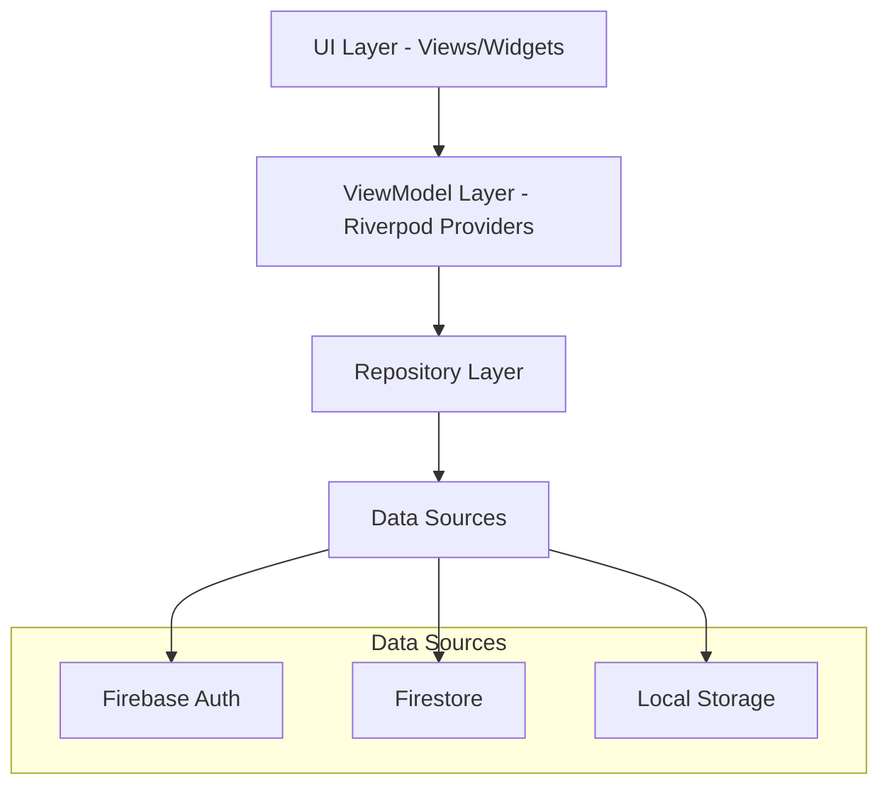

# Design Document

## Overview

The Trip Planner with Friends application is built using Flutter with Riverpod 3.0 for state management, following MVVM architecture with repository pattern. The app uses Firebase for authentication and data storage, with Go Router 16.0 for navigation. The design prioritizes simplicity, real-time collaboration, and cross-platform compatibility.

## Architecture

### High-Level Architecture



### MVVM with Riverpod 3 Pattern

- **View**: Flutter widgets that observe state changes
- **ViewModel**: Riverpod providers that manage business logic and state
- **Model**: Data models using Freezed for immutability
- **Repository**: Abstraction layer for data operations

### State Management Strategy

- **Riverpod 3** with code generation for type safety
- **AsyncValue** for handling loading, error, and data states
- **StateNotifier** for complex state management
- **Provider** for dependency injection

## Components and Interfaces

### Core Models

```dart
@freezed
abstract class Trip with _$Trip {
  const factory Trip({
    required String id,
    required String name,
    required int durationDays,
    required String ownerId,
    required List<String> collaboratorIds,
    required DateTime createdAt,
    required DateTime updatedAt,
  }) = _Trip;
  
  factory Trip.fromJson(Map<String, dynamic> json) => _$TripFromJson(json);
}

@freezed
abstract class Activity with _$Activity {
  const factory Activity({
    required String id,
    required String tripId,
    required String place,
    required String activityType,
    String? price,
    String? notes,
    String? assignedDay, // null if in activity pool
    int? dayOrder,
    String? timeSlot, // e.g., "09:00", "14:30" - time for the activity
    required String createdBy,
    required DateTime createdAt,
    required List<BrainstormIdea> brainstormIdeas,
  }) = _Activity;
  
  factory Activity.fromJson(Map<String, dynamic> json) => _$ActivityFromJson(json);
}

@freezed
abstract class BrainstormIdea with _$BrainstormIdea {
  const factory BrainstormIdea({
    required String id,
    required String description,
    required String createdBy,
    required DateTime createdAt,
    required int order, // for reordering brainstorm ideas
  }) = _BrainstormIdea;
  
  factory BrainstormIdea.fromJson(Map<String, dynamic> json) => _$BrainstormIdeaFromJson(json);
}

@freezed
abstract class User with _$User {
  const factory User({
    required String id,
    required String email,
    required String displayName,
    String? photoUrl,
  }) = _User;
  
  factory User.fromJson(Map<String, dynamic> json) => _$UserFromJson(json);
}
```

### Repository Interfaces

```dart
abstract class AuthRepository {
  Stream<User?> get authStateChanges;
  Future<User?> signInWithGoogle();
  Future<User?> signInWithApple();
  Future<void> signOut();
  User? get currentUser;
}

abstract class TripRepository {
  Stream<List<Trip>> getUserTrips(String userId);
  Future<Trip> createTrip(Trip trip);
  Future<Trip> updateTrip(Trip trip);
  Future<void> deleteTrip(String tripId);
  Future<void> addCollaborator(String tripId, String email);
}

abstract class ActivityRepository {
  Stream<List<Activity>> getTripActivities(String tripId);
  Future<Activity> createActivity(Activity activity);
  Future<Activity> updateActivity(Activity activity);
  Future<void> deleteActivity(String activityId);
  Future<Activity> addBrainstormIdea(String activityId, BrainstormIdea idea);
  Future<Activity> assignActivityToDay(String activityId, String day, String? timeSlot);
  Future<Activity> moveActivityToPool(String activityId);
  Future<void> reorderActivitiesInDay(String tripId, String day, List<String> activityIds);
  Future<void> reorderBrainstormIdeas(String activityId, List<String> ideaIds);
}
```

### Riverpod Providers

```dart
// Auth Providers
@riverpod
class AuthNotifier extends _$AuthNotifier {
  @override
  AsyncValue<User?> build() {
    return const AsyncValue.loading();
  }
  
  Future<void> signInWithGoogle() async {
    state = const AsyncValue.loading();
    try {
      final user = await ref.read(authRepositoryProvider).signInWithGoogle();
      state = AsyncValue.data(user);
    } catch (error, stackTrace) {
      state = AsyncValue.error(error, stackTrace);
    }
  }
}

// Trip Providers
@riverpod
class TripListNotifier extends _$TripListNotifier {
  @override
  Stream<List<Trip>> build() {
    final user = ref.watch(authNotifierProvider).value;
    if (user == null) return Stream.value([]);
    return ref.read(tripRepositoryProvider).getUserTrips(user.id);
  }
}

@riverpod
class TripDetailNotifier extends _$TripDetailNotifier {
  @override
  AsyncValue<Trip?> build(String tripId) {
    // Implementation for single trip management
  }
}

// Activity Providers
@riverpod
class ActivityListNotifier extends _$ActivityListNotifier {
  @override
  Stream<List<Activity>> build(String tripId) {
    return ref.read(activityRepositoryProvider).getTripActivities(tripId);
  }
  
  Future<void> assignActivityToDay(String activityId, String day, String? timeSlot) async {
    await ref.read(activityRepositoryProvider).assignActivityToDay(activityId, day, timeSlot);
  }
  
  Future<void> moveActivityToPool(String activityId) async {
    await ref.read(activityRepositoryProvider).moveActivityToPool(activityId);
  }
  
  Future<void> reorderActivitiesInDay(String day, List<String> activityIds) async {
    await ref.read(activityRepositoryProvider).reorderActivitiesInDay(tripId, day, activityIds);
  }
}

// Drag and Drop Provider
@riverpod
class DragDropNotifier extends _$DragDropNotifier {
  @override
  DragDropState build() {
    return const DragDropState();
  }
  
  void startDrag(Activity activity) {
    state = state.copyWith(draggedActivity: activity, isDragging: true);
  }
  
  void endDrag() {
    state = state.copyWith(draggedActivity: null, isDragging: false);
  }
  
  Future<void> dropOnDay(String day, String? timeSlot) async {
    if (state.draggedActivity != null) {
      await ref.read(activityListNotifierProvider(state.draggedActivity!.tripId).notifier)
          .assignActivityToDay(state.draggedActivity!.id, day, timeSlot);
      endDrag();
    }
  }
  
  Future<void> dropOnPool() async {
    if (state.draggedActivity != null) {
      await ref.read(activityListNotifierProvider(state.draggedActivity!.tripId).notifier)
          .moveActivityToPool(state.draggedActivity!.id);
      endDrag();
    }
  }
}

@freezed
class DragDropState with _$DragDropState {
  const factory DragDropState({
    Activity? draggedActivity,
    @Default(false) bool isDragging,
  }) = _DragDropState;
}
```

### Drag and Drop Components

```dart
// Draggable Activity Card
class DraggableActivityCard extends ConsumerWidget {
  final Activity activity;
  
  @override
  Widget build(BuildContext context, WidgetRef ref) {
    return Draggable<Activity>(
      data: activity,
      feedback: ActivityCard(activity: activity, isDragging: true),
      childWhenDragging: ActivityCard(activity: activity, isPlaceholder: true),
      onDragStarted: () => ref.read(dragDropNotifierProvider.notifier).startDrag(activity),
      onDragEnd: (_) => ref.read(dragDropNotifierProvider.notifier).endDrag(),
      child: ActivityCard(activity: activity),
    );
  }
}

// Drop Target for Days
class DayDropTarget extends ConsumerWidget {
  final String day;
  final List<Activity> activities;
  
  @override
  Widget build(BuildContext context, WidgetRef ref) {
    return DragTarget<Activity>(
      onAccept: (activity) async {
        // Show time picker dialog
        final timeSlot = await showTimePicker(context: context);
        await ref.read(dragDropNotifierProvider.notifier)
            .dropOnDay(day, timeSlot?.format(context));
      },
      builder: (context, candidateData, rejectedData) {
        return Container(
          decoration: BoxDecoration(
            border: candidateData.isNotEmpty 
                ? Border.all(color: Theme.of(context).primaryColor, width: 2)
                : null,
          ),
          child: Column(
            children: [
              Text('Day ${day.split('-')[1]}'),
              ...activities.map((activity) => DraggableActivityCard(activity: activity)),
              if (candidateData.isNotEmpty)
                Container(
                  height: 60,
                  color: Theme.of(context).primaryColor.withOpacity(0.1),
                  child: const Center(child: Text('Drop here')),
                ),
            ],
          ),
        );
      },
    );
  }
}

// Activity Pool Drop Target
class ActivityPoolDropTarget extends ConsumerWidget {
  final List<Activity> poolActivities;
  
  @override
  Widget build(BuildContext context, WidgetRef ref) {
    return DragTarget<Activity>(
      onAccept: (activity) async {
        await ref.read(dragDropNotifierProvider.notifier).dropOnPool();
      },
      builder: (context, candidateData, rejectedData) {
        return Container(
          decoration: BoxDecoration(
            border: candidateData.isNotEmpty 
                ? Border.all(color: Theme.of(context).primaryColor, width: 2)
                : null,
          ),
          child: Column(
            children: [
              const Text('Activity Pool'),
              ...poolActivities.map((activity) => DraggableActivityCard(activity: activity)),
              if (candidateData.isNotEmpty)
                Container(
                  height: 60,
                  color: Theme.of(context).primaryColor.withOpacity(0.1),
                  child: const Center(child: Text('Return to pool')),
                ),
            ],
          ),
        );
      },
    );
  }
}
```

### Navigation Structure

```dart
@riverpod
GoRouter router(Ref ref) {
  return GoRouter(
    initialLocation: '/auth',
    redirect: (context, state) {
      final isAuthenticated = ref.read(authNotifierProvider).value != null;
      final isAuthRoute = state.location.startsWith('/auth');
      
      if (!isAuthenticated && !isAuthRoute) return '/auth';
      if (isAuthenticated && isAuthRoute) return '/trips';
      return null;
    },
    routes: [
      GoRoute(
        path: '/auth',
        builder: (context, state) => const AuthScreen(),
      ),
      GoRoute(
        path: '/trips',
        builder: (context, state) => const TripListScreen(),
        routes: [
          GoRoute(
            path: '/:tripId',
            builder: (context, state) => TripDetailScreen(
              tripId: state.pathParameters['tripId']!,
            ),
            routes: [
              GoRoute(
                path: '/activity/:activityId',
                builder: (context, state) => ActivityDetailScreen(
                  tripId: state.pathParameters['tripId']!,
                  activityId: state.pathParameters['activityId']!,
                ),
              ),
            ],
          ),
        ],
      ),
    ],
  );
}
```

## Data Models

### Firestore Collections Structure

```
users/
  {userId}/
    - id: string
    - email: string
    - displayName: string
    - photoUrl: string?

trips/
  {tripId}/
    - id: string
    - name: string
    - durationDays: number
    - ownerId: string
    - collaboratorIds: array<string>
    - createdAt: timestamp
    - updatedAt: timestamp

activities/
  {activityId}/
    - id: string
    - tripId: string
    - place: string
    - activityType: string
    - price: string?
    - notes: string?
    - assignedDay: string? (e.g., "day-1", "day-2", null for activity pool)
    - dayOrder: number?
    - timeSlot: string? (e.g., "09:00", "14:30" - 24-hour format)
    - createdBy: string
    - createdAt: timestamp
    - brainstormIdeas: array<BrainstormIdea> (with order field for reordering)
```

### Security Rules

```javascript
rules_version = '2';
service cloud.firestore {
  match /databases/{database}/documents {
    // Users can read/write their own user document
    match /users/{userId} {
      allow read, write: if request.auth != null && request.auth.uid == userId;
    }
    
    // Trip access control
    match /trips/{tripId} {
      allow read, write: if request.auth != null && 
        (resource.data.ownerId == request.auth.uid || 
         request.auth.uid in resource.data.collaboratorIds);
    }
    
    // Activity access control
    match /activities/{activityId} {
      allow read, write: if request.auth != null && 
        exists(/databases/$(database)/documents/trips/$(resource.data.tripId)) &&
        (get(/databases/$(database)/documents/trips/$(resource.data.tripId)).data.ownerId == request.auth.uid ||
         request.auth.uid in get(/databases/$(database)/documents/trips/$(resource.data.tripId)).data.collaboratorIds);
    }
  }
}
```

## Error Handling

### Error Types

```dart
@freezed
class AppError with _$AppError {
  const factory AppError.network(String message) = NetworkError;
  const factory AppError.authentication(String message) = AuthenticationError;
  const factory AppError.permission(String message) = PermissionError;
  const factory AppError.validation(String message) = ValidationError;
  const factory AppError.unknown(String message) = UnknownError;
}
```

### Error Handling Strategy

- **Repository Level**: Catch and transform exceptions into AppError types
- **Provider Level**: Use AsyncValue.error to propagate errors
- **UI Level**: Display user-friendly error messages with retry options
- **Offline Support**: Queue operations when offline, sync when online

### Global Error Handler

```dart
@riverpod
class ErrorNotifier extends _$ErrorNotifier {
  @override
  AppError? build() => null;
  
  void showError(AppError error) {
    state = error;
    // Auto-clear after 5 seconds
    Timer(const Duration(seconds: 5), () => state = null);
  }
  
  void clearError() => state = null;
}
```

## Testing Strategy

### Unit Testing

- **Models**: Test serialization/deserialization with Freezed
- **Repositories**: Mock Firebase services, test CRUD operations
- **Providers**: Test state transitions and business logic
- **Utilities**: Test helper functions and extensions

### Widget Testing

- **Screens**: Test UI rendering and user interactions
- **Components**: Test reusable widgets in isolation
- **Navigation**: Test route transitions and parameter passing

### Integration Testing

- **Authentication Flow**: Test complete login/logout process
- **Trip Management**: Test trip creation, collaboration, and updates
- **Real-time Updates**: Test Firestore stream updates
- **Cross-platform**: Test on web, iOS, and Android

### Testing Structure

```
test/
├── unit/
│   ├── models/
│   ├── repositories/
│   ├── providers/
│   └── utils/
├── widget/
│   ├── screens/
│   ├── components/
│   └── common/
└── integration/
    ├── auth_flow_test.dart
    ├── trip_management_test.dart
    └── collaboration_test.dart
```

## Time Slot Management

### Time Slot Implementation

```dart
// Time Slot Utilities
class TimeSlotUtils {
  static String formatTimeSlot(String timeSlot) {
    // Convert "09:00" to "9:00 AM"
    final time = TimeOfDay.fromDateTime(DateTime.parse('2023-01-01 $timeSlot:00'));
    return time.format(context);
  }
  
  static List<Activity> sortActivitiesByTime(List<Activity> activities) {
    return activities.where((a) => a.timeSlot != null).toList()
      ..sort((a, b) => a.timeSlot!.compareTo(b.timeSlot!));
  }
  
  static bool isValidTimeSlot(String timeSlot) {
    final regex = RegExp(r'^([01]?[0-9]|2[0-3]):[0-5][0-9]$');
    return regex.hasMatch(timeSlot);
  }
}

// Time Slot Picker Widget
class TimeSlotPicker extends StatelessWidget {
  final String? initialTime;
  final Function(String?) onTimeSelected;
  
  @override
  Widget build(BuildContext context) {
    return Column(
      children: [
        ListTile(
          title: const Text('Set Time'),
          subtitle: Text(initialTime ?? 'No time set'),
          trailing: const Icon(Icons.access_time),
          onTap: () async {
            final time = await showTimePicker(
              context: context,
              initialTime: initialTime != null 
                  ? TimeOfDay.fromDateTime(DateTime.parse('2023-01-01 $initialTime:00'))
                  : TimeOfDay.now(),
            );
            if (time != null) {
              final timeString = '${time.hour.toString().padLeft(2, '0')}:${time.minute.toString().padLeft(2, '0')}';
              onTimeSelected(timeString);
            }
          },
        ),
        if (initialTime != null)
          TextButton(
            onPressed: () => onTimeSelected(null),
            child: const Text('Remove Time'),
          ),
      ],
    );
  }
}
```

### Day View with Time Slots

```dart
class DayTimelineView extends ConsumerWidget {
  final String tripId;
  final String day;
  
  @override
  Widget build(BuildContext context, WidgetRef ref) {
    final activities = ref.watch(activityListNotifierProvider(tripId))
        .value
        ?.where((a) => a.assignedDay == day)
        .toList() ?? [];
    
    final sortedActivities = TimeSlotUtils.sortActivitiesByTime(activities);
    final untimedActivities = activities.where((a) => a.timeSlot == null).toList();
    
    return Column(
      children: [
        // Timed activities in chronological order
        ...sortedActivities.map((activity) => TimeSlotActivityCard(activity: activity)),
        
        // Divider
        if (sortedActivities.isNotEmpty && untimedActivities.isNotEmpty)
          const Divider(),
        
        // Untimed activities
        ...untimedActivities.map((activity) => DraggableActivityCard(activity: activity)),
      ],
    );
  }
}

class TimeSlotActivityCard extends StatelessWidget {
  final Activity activity;
  
  @override
  Widget build(BuildContext context) {
    return Card(
      child: ListTile(
        leading: Text(
          TimeSlotUtils.formatTimeSlot(activity.timeSlot!),
          style: Theme.of(context).textTheme.titleMedium,
        ),
        title: Text(activity.place),
        subtitle: Text(activity.activityType),
        trailing: IconButton(
          icon: const Icon(Icons.edit_time),
          onPressed: () => _editTimeSlot(context),
        ),
      ),
    );
  }
  
  void _editTimeSlot(BuildContext context) {
    // Show time picker to edit time slot
  }
}
```

## Performance Considerations

### Optimization Strategies

1. **Firestore Optimization**
   - Use compound indexes for complex queries
   - Implement pagination for large trip lists
   - Cache frequently accessed data locally

2. **State Management**
   - Use `select` to prevent unnecessary rebuilds
   - Implement proper provider disposal
   - Use `family` providers for parameterized state

3. **UI Performance**
   - Implement lazy loading for trip lists
   - Use `ListView.builder` for dynamic lists
   - Optimize image loading with `cached_network_image`

4. **Real-time Updates**
   - Use Firestore listeners efficiently
   - Implement debouncing for rapid updates
   - Handle connection state changes gracefully

### Memory Management

- Dispose providers when not needed
- Use weak references for callbacks
- Implement proper stream subscription management
- Cache management for images and data

## Platform-Specific Considerations

### Web Platform
- Responsive design with breakpoints
- Web-specific authentication flows
- Browser storage for offline capabilities
- PWA features for app-like experience

### Mobile Platforms
- Native authentication (Google/Apple)
- Touch gestures for drag-and-drop
- Platform-specific UI components
- Background sync capabilities

### Tablet Platform
- Optimized layouts for larger screens
- Split-view for trip and activity management
- Enhanced collaboration features
- Multi-window support where available